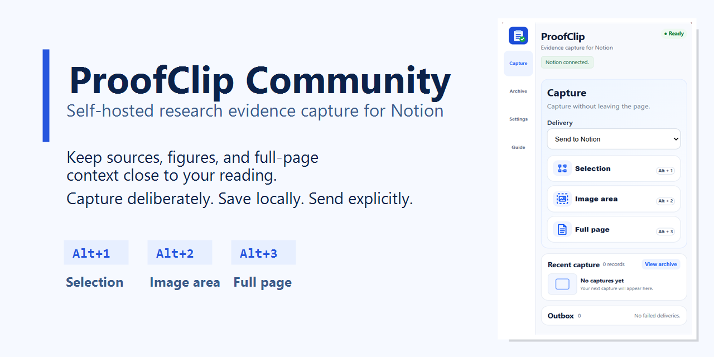
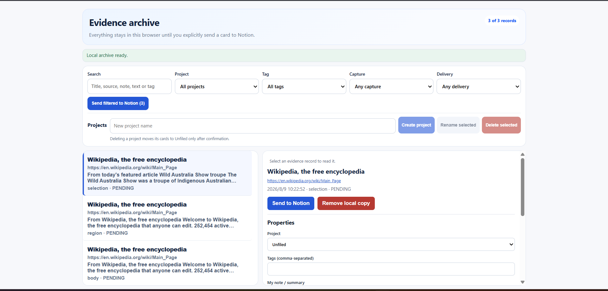
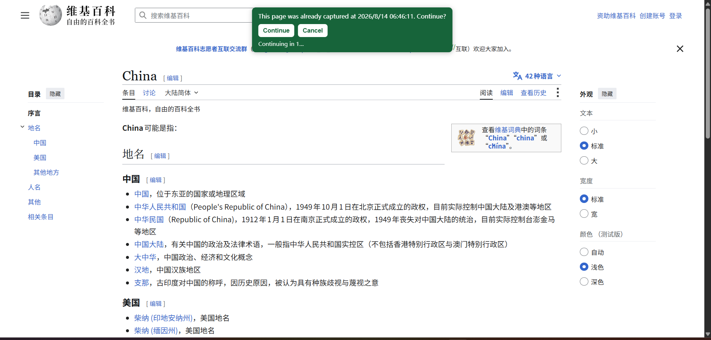
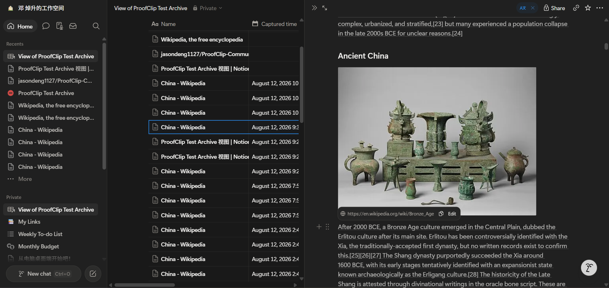

# ProofClip Community

Copyright (C) 2026 Jason. Licensed under [AGPL-3.0-only](LICENSE).

ProofClip Community is an open-source, self-hosted research evidence workbench built around a simple idea: captured information is most useful when its source, context, and the reason it mattered stay together. It helps researchers preserve passages, figures, and full-page evidence while keeping provenance and later interpretation connected to the original reading context.
ProofClip is designed around the reading flow itself. Capturing evidence should feel like a small gesture, not a context switch: notice something worth keeping, capture it, and keep reading. Organization, mapping, and delivery should support that flow rather than interrupt it.
This leads to a simple product philosophy: capture with as little friction as possible, preserve enough context to make the evidence useful later, and keep the path from reading to archive to Notion predictable and dependable. The tool should stay out of the way when it is not needed and be reliable when it is.

## Latest release — v0.8.0

**ProofClip Community 0.8.0 is now available.**

This release strengthens the capture-to-Notion workflow, self-hosted deployment, and delivery reliability while keeping ProofClip Community local-first and under the deployer's control.

### What's new

- **Three capture modes** — save a text selection, image area, or full page with keyboard-first shortcuts.
- **Local-first Archive** — capture first, then organize, search, annotate, and decide what should be sent to Notion.
- **Improved Notion workflow** — OAuth connection, Data Source setup, and configurable field mapping for repeatable research workflows.
- **More reliable delivery** — delivery status, Outbox recovery, resend support, and duplicate-delivery protection.
- **Self-hosted Worker + D1** — operate your own Community backend and Notion OAuth integration.
- **Privacy-focused delivery** — capture bodies and screenshots are not retained by the Worker after the requested delivery.
- **Detailed self-hosting guide** — a verified deployment path covering Cloudflare Worker, D1, Notion OAuth, extension configuration, and first-run validation.

**[View v0.8.0 release notes](https://github.com/jasondeng1127/ProofClip-Community/releases/tag/v0.8.0)** · **[Download v0.8.0](https://github.com/jasondeng1127/ProofClip-Community/releases/tag/v0.8.0)** · **[Deployment guide](deploy/README.md)**

## Choose the right path before you start

Choose **Community** when you are comfortable operating your own Cloudflare Worker, D1 database, Notion OAuth integration, extension configuration, upgrades, and backups. It is the right path for researchers, labs, and technical teams that want a self-hosted, inspectable baseline and control of their own deployment.

Do not choose Community expecting a Chrome Web Store install, a managed API, or automatic updates. This release is source-first: you load `extension/src` as an unpacked Chrome extension and operate the required services yourself.

If you prefer a managed, ready-to-use experience with no infrastructure deployment, see [Commercial edition availability](docs/edition-availability.md). The Commercial edition is not currently available.

## Keep research moving

Capture while reading, then open the saved Archive record to add a personal note about why the evidence matters. Use the keyboard-first capture mode that matches the material in front of you:

| Shortcut | Capture mode | Useful when |
| --- | --- | --- |
| `Alt+1` | Selection | A quotation or claim needs its page source. |
| `Alt+2` | Image area | A figure, table, or other visual evidence matters. |
| `Alt+3` | Full page | The surrounding context matters as much as the passage. |

## Save locally, deliver deliberately

Captures default to the local Archive. Keep them there for review, personal notes, projects, tags, and search; editable templates and field mapping help make repeated research workflows consistent. A user may explicitly select direct delivery during capture, but there is no background or automatic sync. Failed explicit deliveries remain available in the Outbox for review and retry.

## Community edition vs Commercial edition

| | Community edition | Commercial edition |
| --- | --- | --- |
| Best for | Researchers and teams who want control and self-hosting. | Users who prefer a managed, ready-to-use experience. |
| Deployment | The deployer operates the Worker, D1 database, Notion OAuth, extension configuration, backups, and operations. | Managed infrastructure; no Worker, D1, or OAuth deployment by the user. |
| Control and updates | Inspectable, deployer-owned infrastructure with user-managed updates. | Managed infrastructure and managed updates when available. |
| Core value | A complete, local-first and inspectable evidence workflow under the deployer's control. | Convenience and managed operations. |

The Commercial edition is not currently available. When released, its intended path is download, one-click initialization, and use; connecting a user's own Notion workspace remains an explicit authorization step. Read [Commercial edition availability](docs/edition-availability.md) for the current status.

## First successful Community capture

After the technical deployment is complete, use this short path to confirm the research workflow rather than treating a deployed Worker as proof of a usable setup:

1. [Load the extension and configure its HTTPS API origin](docs/getting-started.md#1-load-and-connect-the-extension).
2. Connect the deployer's Notion integration, choose a Data Source, and map its required **Title** and **URL** properties.
3. On a page you are researching, press `Alt+1`, `Alt+2`, or `Alt+3`; save locally by default or deliberately choose **Send to Notion** for that capture.
4. Confirm the expected record in Notion: a title and source URL at minimum, plus the capture content and any optional mapped fields you selected.

The full, source-only loading path, first-success checklist, and data-boundary explanation are in [Getting started](docs/getting-started.md).

## Deploy your own Community instance

ProofClip Community uses a deployer-owned Cloudflare Worker/D1 service and Notion OAuth integration. Each deployer configures its own extension ID and HTTPS API origin. There is no central ProofClip-hosted dependency: captures stay in the browser until the user explicitly sends them, and the deployer's Worker writes the requested record to Notion without retaining capture bodies or screenshots.

Read [the detailed project introduction](docs/project-introduction.md), [Getting started](docs/getting-started.md), [the deployment guide](deploy/README.md), [architecture](docs/architecture.md), [security model](docs/security.md), [Notion OAuth guide](docs/self-hosted-notion-oauth.md), [Commercial edition availability](docs/edition-availability.md), and [release checklist](docs/acceptance/community-release-checklist.md) before operating a deployment. [TRADEMARKS.md](TRADEMARKS.md) states the separate brand-use restriction.
