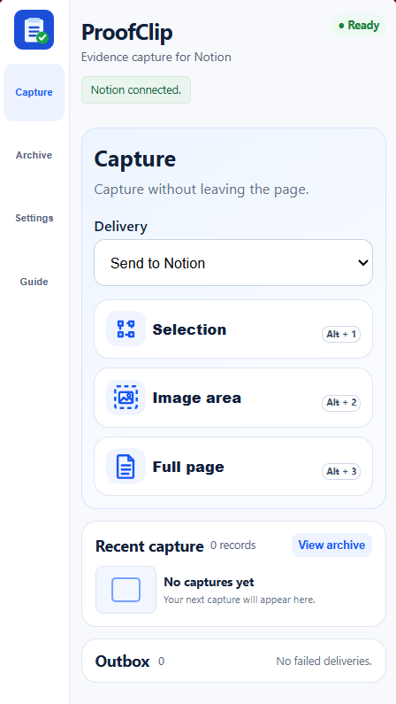
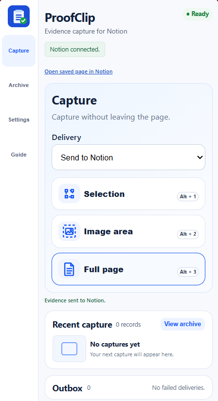
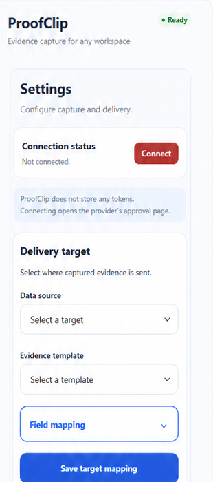

# ProofClip Community

Copyright (C) 2026 Jason. Licensed under [AGPL-3.0-only](LICENSE).

ProofClip Community is a self-hosted research workbench for keeping web evidence close to the reading that produced it. It helps literature, academic, and document researchers preserve a useful passage, figure, or full page with its source, then return to it without breaking concentration.

## Choose the right path before you start

Choose **Community** when you are comfortable operating your own Cloudflare Worker, D1 database, Notion OAuth integration, extension configuration, upgrades, and backups. It is the right path for researchers, labs, and technical teams that want a self-hosted, inspectable baseline and control of their own deployment.

Do not choose Community expecting a Chrome Web Store install, a managed API, or automatic updates. This release is source-first: you load `extension/src` as an unpacked Chrome extension and operate the required services yourself.

If you prefer a cloud-managed experience with no infrastructure deployment, see [Commercial edition availability](docs/edition-availability.md). The Commercial edition is **not available yet**; its release depends on restoration of the Google account currently under appeal.

## Keep research moving

Capture while reading, then open the saved Archive record to add a personal note about why the evidence matters. Use the keyboard-first capture mode that matches the material in front of you:

| Shortcut | Capture mode | Useful when |
| --- | --- | --- |
| `Alt+1` | Selection | A quotation or claim needs its page source. |
| `Alt+2` | Image area | A figure, table, or other visual evidence matters. |
| `Alt+3` | Full page | The surrounding context matters as much as the passage. |

## Save locally, deliver deliberately

Captures default to the local Archive. Keep them there for review, personal notes, projects, tags, and search; editable templates and field mapping help make repeated research workflows consistent. A user may explicitly select direct delivery during capture, but there is no background or automatic sync. Failed explicit deliveries remain available in the Outbox for review and retry.

## Community edition vs Commercial edition

| | Community edition | Commercial edition |
| --- | --- | --- |
| Best fit | Users who want to self-deploy and operate it themselves. | Users who want a more complete feature set, a more polished experience, continuing version updates, and a cloud-managed service. |
| Responsibility | The deployer runs the Worker, D1 database, Notion OAuth, upgrades, backups, and operations. | Commercial terms are separate from this self-hosted Community baseline. |

The Commercial edition is not available today. When released, it is intended to be cloud-managed: no Worker, D1, or OAuth deployment by the user; download, one-click initialization, then connect the user's own Notion workspace through an explicit authorization step. Read the current [availability and delivery statement](docs/edition-availability.md) before relying on it.

## First successful Community capture

After the technical deployment is complete, use this short path to confirm the research workflow rather than treating a deployed Worker as proof of a usable setup:

1. [Load the extension and configure its HTTPS API origin](docs/getting-started.md#1-load-and-connect-the-extension).
2. Connect the deployer's Notion integration, choose a Data Source, and map its required **Title** and **URL** properties.
3. On a page you are researching, press `Alt+1`, `Alt+2`, or `Alt+3`; save locally by default or deliberately choose **Send to Notion** for that capture.
4. Confirm the expected record in Notion: a title and source URL at minimum, plus the capture content and any optional mapped fields you selected.

The full, source-only loading path, first-success checklist, and data-boundary explanation are in [Getting started](docs/getting-started.md).

## Deploy your own Community instance

ProofClip Community uses a deployer-owned Cloudflare Worker/D1 service and Notion OAuth integration. Each deployer configures its own extension ID and HTTPS API origin. There is no central ProofClip-hosted dependency: captures stay in the browser until the user explicitly sends them, and the deployer's Worker writes the requested record to Notion without retaining capture bodies or screenshots.

Read [the detailed project introduction](docs/project-introduction.md), [Getting started](docs/getting-started.md), [the deployment guide](deploy/README.md), [architecture](docs/architecture.md), [security model](docs/security.md), [Notion OAuth guide](docs/self-hosted-notion-oauth.md), [Commercial edition availability](docs/edition-availability.md), and [release checklist](docs/acceptance/community-release-checklist.md) before operating a deployment. [TRADEMARKS.md](TRADEMARKS.md) states the separate brand-use restriction.
